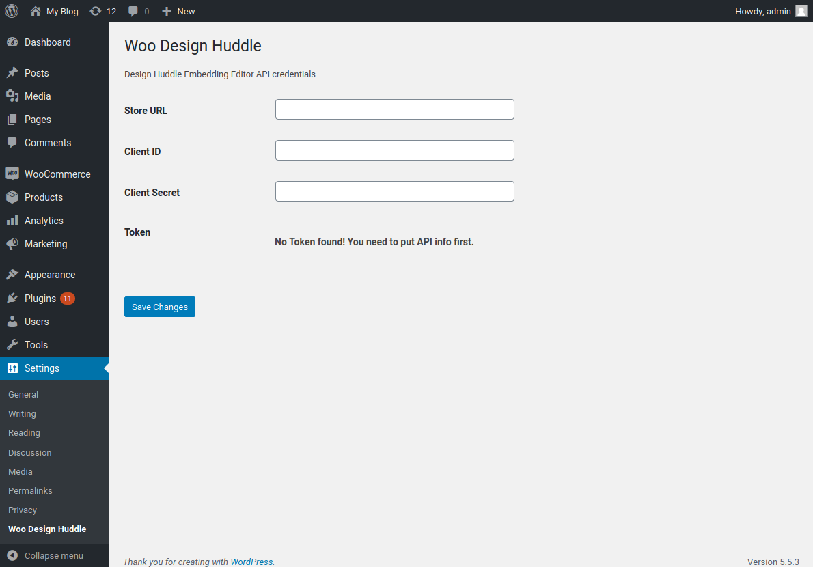
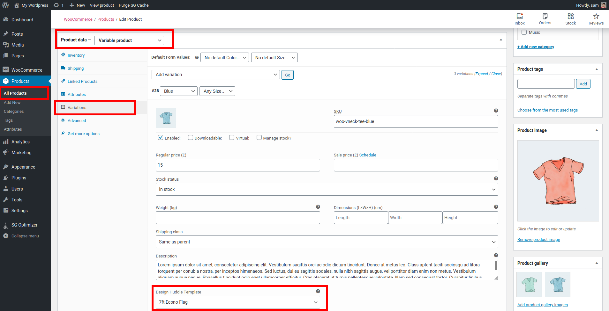

# Design Huddle for WooCommerce
A plugin for WooCommerce to integrate Design Huddle Embeded Editor for product.

### Features:

  - Import product template from Design Huddle and use as template on product edit screen.
  - Use variation to choose template and start designing your product.
  - Add to cart your designed product and choose quantity.
  - View generated prodcut thumbnails on both cart & checkout page and edit existing design is also available.
  - After checkout get complate generated PDF or PNG from both thankyou page and my account page.

### Installation:
  - Download this repo as ZIP and install or Upload `woo-design-huddle` folder to the `/wp-content/plugins/` directory via FTP.
  - Activate `Design Huddle for WooCommerce` through the **Plugins** menu in WordPress.
  - Set your API information on **Settings > Woo Design Huddle** or visit directly `/wp-admin/options-general.php?page=dh_woo_ee`
  - Add your respected template on product edit screen.
  
### Notes:
   - We are using [Magnific Popup](https://dimsemenov.com/plugins/magnific-popup/documentation.html) which can be found automatically if you are using Divi theme otherwise install [WP Magnific Popup](https://wordpress.org/plugins/wp-magnific-popup/) plugin and active

### Screenshots:
**Admin Menu to set API info**

**Set template from product edit screen**

